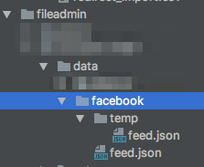
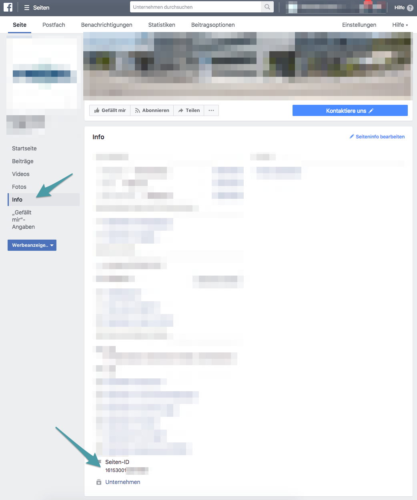

.. include:: ../Includes.txt

.. _admin-manual:

Administrator Manual
====================

.. _admin-installation:

Installation
------------

Its recommended to create your app on facebook first. You'll need a facebook account to do this and your
Facebook-Account needs to be a authenticated administrator trough business-manager for the page you want to show
the feed.

1. Go to https://developers.facebook.com
2. Login with your facebook account
3. Register a new App (My Apps > Create new App)
4. Givem a Application name, and add an email
5. Add all informations about your page, the domain needs to match your website you want to show the feed
6. You'll get a Application ID and an Application Secret

Go back to the TYPO3 Backend and install the extension, perform the following steps:
1. Go to the Extension Manager
2. Install the extension
3. Include the static template
4. Create a new folder in your fileadmin (or elsewhere) and create also a temp-Folder. (Look at the screenshot)
5. Gather the page id of your facebook-page you want to show the feed (Business Manger > Page > Info (screenshot))
6. Go to the scheduler module and create a new task
7. Choose "Facebook - Feed"
8. Enter your Application ID, Application Secret, Page ID, Folder and File
9. Folder: should be absolute to your installation p.E. /home/apache2/public_html/fileadmin/user_upload/facebook/
10. File: p.E. facebook.json
11. Save and test the task. If successfull the task creates a temporary file with your stream in the defined folders

.. _admin-configuration:

Configuration
-------------

To configure the frontend plugin you can either do that in the flexform itself or via typoscript.