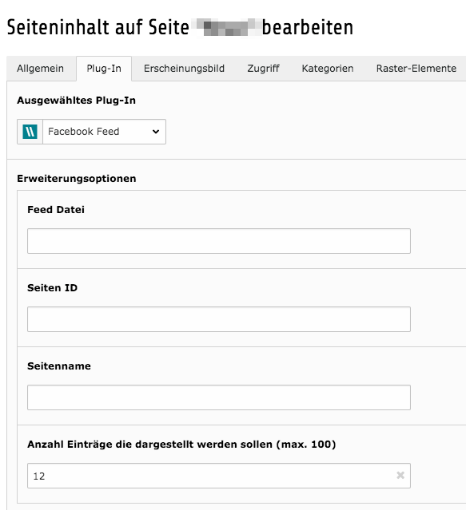
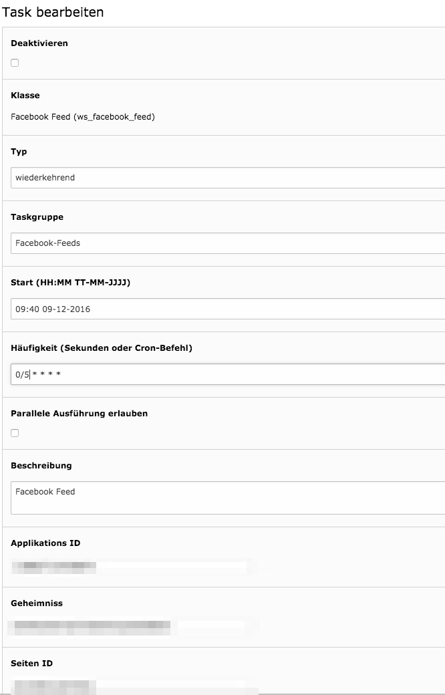

.. include:: ../Includes.txt

.. _introduction:

Introduction
============

.. _what-it-does:

What does it do?
----------------

With this extension you can access your facebook feed and output it on your website.
You need to create an app on https://developers.facebook.com/ and grant access to your page.
Data is fetched with a scheduler task to reduce api calls and improve performance.

.. _screenshots:

Screenshots
-----------

